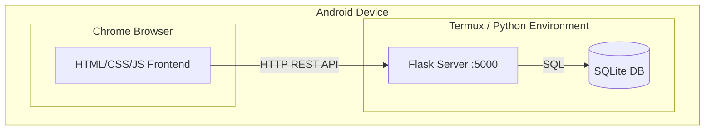
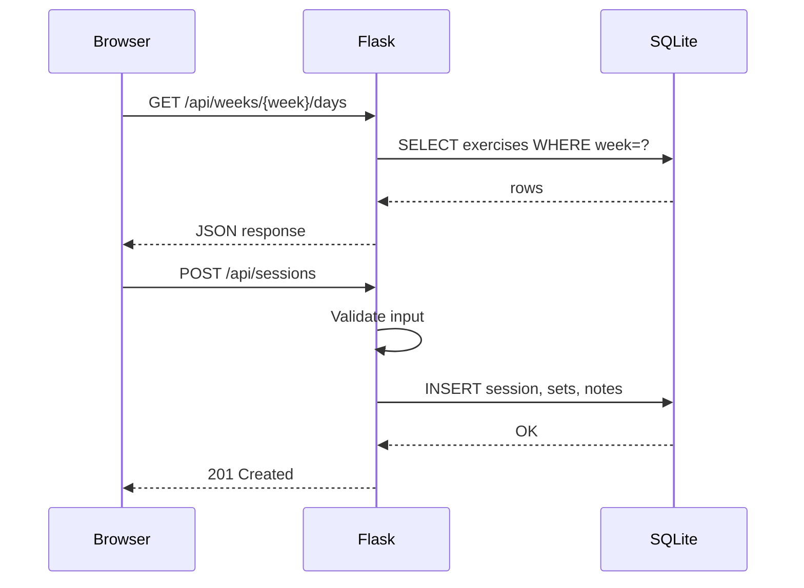

# Design Document: Workout Tracker

## Overview

The Workout Tracker is a locally-hosted web application designed to run on an Android phone via Chrome. It follows a client-server architecture with a Python backend (Flask) serving a mobile-responsive HTML/CSS/JavaScript frontend. All data persists in a local SQLite database, allowing full offline operation after initial setup.

The app enables the user to:
- Load a multi-week strength training program from a CSV file
- Select workout days by week and day number
- Record weight, reps, and notes for each exercise
- View previous performance when repeating a workout day
- Browse full workout history

The system runs on the Android device itself (via Termux or a similar environment), with the Python server binding to localhost and the user accessing it through Chrome.

### Key Design Decisions

| Decision | Choice | Rationale |
|----------|--------|-----------|
| Backend framework | Flask | Lightweight, minimal dependencies, easy to run in constrained environments like Termux |
| Database | SQLite | File-based, zero-config, ships with Python, perfect for single-user local apps |
| Frontend approach | Vanilla HTML/CSS/JS | No build step, no heavy frameworks, fast load times, works offline |
| API style | REST JSON API | Clean separation of frontend/backend, easy to debug, simple to implement |
| Mobile UX | Responsive CSS with large touch targets | Optimized for gym use on a phone screen |

## Architecture



The architecture is a standard two-tier web app collapsed onto a single device:

1. **Flask Server** — Handles HTTP requests, business logic, CSV parsing, data validation, and database operations. Runs on `localhost:5000`.
2. **SQLite Database** — Stores the exercise program, workout sessions, set entries, and notes. Located at a fixed path within the app directory.
3. **Browser Frontend** — Single-page-style UI served as static files by Flask. Communicates with the backend via `fetch()` calls to the REST API.

### Request Flow

> **PWA Caching Note:** The service worker caches only the UI shell (HTML, CSS, JS, manifest, icons). All API calls (`/api/*`) pass through to Flask. This means the server must still be running for data operations, but the app UI loads instantly from cache after initial visit.



## Components and Interfaces

### Backend Components

#### 1. Application Entry Point (`app.py`)

- Creates and configures the Flask application
- Registers blueprints/routes
- Initializes the database on first run
- Serves static frontend files

#### 2. Database Module (`database.py`)

- Manages SQLite connection and schema creation
- Provides helper functions for common queries
- Handles migrations if schema changes

**Interface:**
```python
def get_db() -> sqlite3.Connection
def init_db() -> None
def close_db() -> None
```

#### 3. Program Routes (`routes/program.py`)

Handles exercise program CRUD and CSV upload.

**Endpoints:**
| Method | Path | Description |
|--------|------|-------------|
| GET | `/api/program/weeks` | List all weeks with day counts |
| GET | `/api/program/weeks/{week}/days` | Get days for a specific week |
| GET | `/api/program/weeks/{week}/days/{day}` | Get exercises for a specific day |
| POST | `/api/program/upload` | Upload and parse CSV file |
| GET | `/api/program/current-week` | Get the current program week and days per week |

#### 4. Session Routes (`routes/sessions.py`)

Handles workout session recording and history.

**Endpoints:**
| Method | Path | Description |
|--------|------|-------------|
| POST | `/api/sessions` | Save a new workout session |
| GET | `/api/sessions` | List all sessions (history) |
| GET | `/api/sessions/{id}` | Get a specific session's details |
| GET | `/api/sessions/previous/{week}/{day}` | Get most recent session for a week/day |

#### 5. CSV Parser (`csv_parser.py`)

Validates and parses uploaded CSV files into the program structure.

**Interface:**
```python
@dataclass
class ParsedExercise:
    week: int
    day: int
    exercise_name: str
    sets: int
    target_reps: str

@dataclass
class ParseResult:
    success: bool
    exercises: list[ParsedExercise]
    days_per_week: int  # Determined by distinct days in Week 1
    errors: list[str]  # "Row 5: 'Sets' must be integer 1-10"

def parse_csv(file_content: str) -> ParseResult
```

**Validation rules:**
- The parser determines `days_per_week` from the distinct day values present in Week 1 of the CSV.
- If any subsequent week contains a different number of distinct days than Week 1, the parser returns an error identifying the inconsistent week (e.g., `"Week 3 has 5 days but Week 1 defines 4 days per week"`).

#### 6. Validators (`validators.py`)

Input validation functions for weight, reps, and session data.

**Interface:**
```python
def validate_weight(value: str) -> tuple[bool, float | None, str | None]
def validate_reps(value: str) -> tuple[bool, int | None, str | None]
def validate_session(data: dict) -> tuple[bool, list[str]]
```

### Frontend Components

#### 1. HTML Shell (`templates/index.html`)

The main HTML page served by Flask. For PWA support, it must:
- Link the manifest via `<link rel="manifest" href="/static/manifest.json">`
- Include `<meta name="theme-color">` tag
- Include `<meta name="apple-mobile-web-app-capable" content="yes">` for iOS
- Register the service worker in a `<script>` block at page load

#### 2. Page Router (`app.js`)

Client-side routing using hash-based navigation (`#/`, `#/workout/1/2`, `#/history`).

#### 3. Day Selection View (`views/day-select.js`)

- Displays workout days for the current week (Days 1–N where N is `days_per_week` from the program)
- Week navigation (prev/next)
- Shows "no program" state when empty

#### 4. Workout View (`views/workout.js`)

- Displays exercises with input fields for weight/reps per set
- Shows previous performance data
- Notes input per exercise
- Save button with confirmation/warning flow
- Client-side input validation with error messages

#### 5. History View (`views/history.js`)

- Lists past sessions ordered by date
- Drill-down into session details

#### 6. Upload View (`views/upload.js`)

- CSV file picker
- Displays parse results (success counts or error details)

#### 7. API Client (`api.js`)

Thin wrapper around `fetch()` for all backend communication. All API calls go through this module, which means the service worker can let them pass through to the network without caching.

```javascript
const api = {
    getWeeks: () => fetch('/api/program/weeks').then(r => r.json()),
    getDays: (week) => fetch(`/api/program/weeks/${week}/days`).then(r => r.json()),
    getExercises: (week, day) => fetch(`/api/program/weeks/${week}/days/${day}`).then(r => r.json()),
    getPreviousSession: (week, day) => fetch(`/api/sessions/previous/${week}/${day}`).then(r => r.json()),
    saveSession: (data) => fetch('/api/sessions', { method: 'POST', headers: {'Content-Type': 'application/json'}, body: JSON.stringify(data) }).then(r => r.json()),
    getHistory: () => fetch('/api/sessions').then(r => r.json()),
    getSession: (id) => fetch(`/api/sessions/${id}`).then(r => r.json()),
    uploadCSV: (file) => { const fd = new FormData(); fd.append('file', file); return fetch('/api/program/upload', { method: 'POST', body: fd }).then(r => r.json()); }
};
```

#### 8. Service Worker (`static/sw.js`)

- Implements a cache-first strategy for the application shell (HTML, CSS, JS, icons)
- On install: pre-caches all static assets
- On fetch: serves from cache first, falling back to network for API calls (`/api/*` routes are never cached)
- Cache versioning: update cache name on deployment to bust stale caches

#### 9. Web App Manifest (`static/manifest.json`)

- `name`: "Strength Tracker"
- `short_name`: "Strength"
- `start_url`: "/"
- `display`: "standalone"
- `theme_color`: appropriate dark/gym theme color
- `background_color`: matching background
- `icons`: array with 192x192 and 512x512 PNG icons

## Data Models

### SQLite Schema

```sql
-- Exercise program loaded from CSV
CREATE TABLE exercises (
    id INTEGER PRIMARY KEY AUTOINCREMENT,
    week INTEGER NOT NULL CHECK(week >= 1 AND week <= 52),
    day INTEGER NOT NULL CHECK(day >= 1 AND day <= 7),
    exercise_name TEXT NOT NULL CHECK(length(exercise_name) <= 100),
    target_sets INTEGER NOT NULL CHECK(target_sets >= 1 AND target_sets <= 10),
    target_reps TEXT NOT NULL CHECK(length(target_reps) <= 20),
    sort_order INTEGER NOT NULL,
    UNIQUE(week, day, exercise_name)
);

-- A completed workout session
CREATE TABLE sessions (
    id INTEGER PRIMARY KEY AUTOINCREMENT,
    week INTEGER NOT NULL,
    day INTEGER NOT NULL,
    completed_at TEXT NOT NULL,  -- ISO 8601 datetime to the minute
    created_at TEXT NOT NULL DEFAULT (datetime('now'))
);

-- Individual set recordings within a session
CREATE TABLE set_entries (
    id INTEGER PRIMARY KEY AUTOINCREMENT,
    session_id INTEGER NOT NULL REFERENCES sessions(id) ON DELETE CASCADE,
    exercise_name TEXT NOT NULL,
    set_number INTEGER NOT NULL CHECK(set_number >= 1 AND set_number <= 10),
    weight REAL CHECK(weight >= 0.5 AND weight <= 9999),
    reps INTEGER CHECK(reps >= 1 AND reps <= 999),
    UNIQUE(session_id, exercise_name, set_number)
);

-- Notes attached to exercises within a session
CREATE TABLE notes (
    id INTEGER PRIMARY KEY AUTOINCREMENT,
    session_id INTEGER NOT NULL REFERENCES sessions(id) ON DELETE CASCADE,
    exercise_name TEXT NOT NULL,
    note_text TEXT CHECK(length(note_text) <= 500),
    UNIQUE(session_id, exercise_name)
);

-- App state (current week tracking, unsaved session data)
CREATE TABLE app_state (
    key TEXT PRIMARY KEY,
    value TEXT NOT NULL
);
```

### API Data Shapes

**GET `/api/program/weeks/{week}/days/{day}`**
```json
{
    "week": 1,
    "day": 1,
    "exercises": [
        {
            "exercise_name": "Incline DB Press (15-30°)",
            "target_sets": 4,
            "target_reps": "5–8"
        }
    ]
}
```

**GET `/api/sessions/previous/{week}/{day}`**
```json
{
    "session_id": 12,
    "completed_at": "2025-01-15T09:32",
    "exercises": {
        "Incline DB Press (15-30°)": {
            "sets": [
                {"set_number": 1, "weight": 35.0, "reps": 8},
                {"set_number": 2, "weight": 35.0, "reps": 7},
                {"set_number": 3, "weight": 32.5, "reps": 6},
                {"set_number": 4, "weight": 32.5, "reps": 5}
            ],
            "note": "Left shoulder felt tight on last 2 sets"
        }
    }
}
```

**POST `/api/sessions`** (request body)
```json
{
    "week": 1,
    "day": 1,
    "sets": [
        {"exercise_name": "Incline DB Press (15-30°)", "set_number": 1, "weight": 35.0, "reps": 8},
        {"exercise_name": "Incline DB Press (15-30°)", "set_number": 2, "weight": 35.0, "reps": 7}
    ],
    "notes": [
        {"exercise_name": "Incline DB Press (15-30°)", "note": "Felt strong today"}
    ]
}
```

**GET `/api/program/current-week`**
```json
{
    "current_week": 1,
    "days_per_week": 4,
    "total_weeks": 12
}
```

**GET `/api/sessions`** (history list)
```json
{
    "sessions": [
        {"id": 12, "week": 1, "day": 1, "completed_at": "2025-01-15T09:32"},
        {"id": 11, "week": 1, "day": 3, "completed_at": "2025-01-14T10:15"}
    ]
}
```

### In-Memory State (Frontend)

The frontend maintains temporary state for the active workout:
- Current set entries (weight/reps per exercise per set)
- Current notes per exercise
- Dirty flag (unsaved changes exist)

This state lives in JavaScript memory and is not persisted until the user explicitly saves. If the browser is closed, the backend retains a copy in `app_state` (serialized JSON) so the session can be resumed.


## Correctness Properties

*A property is a characteristic or behavior that should hold true across all valid executions of a system — essentially, a formal statement about what the system should do. Properties serve as the bridge between human-readable specifications and machine-verifiable correctness guarantees.*

### Property 1: Exercise retrieval correctness

*For any* valid program loaded into the database and *for any* week/day combination that exists in that program, querying the exercises for that week/day SHALL return exactly the exercises defined for that combination, each with the correct exercise name, target sets, and target reps.

**Validates: Requirements 1.2, 9.3, 9.4**

### Property 2: Weight validation accepts valid and rejects invalid

*For any* numeric value between 0.5 and 9999 (inclusive) with at most one decimal place, the weight validator SHALL accept it. *For any* value that is non-numeric, negative, zero, or exceeds 9999, or has more than one decimal place, the weight validator SHALL reject it.

**Validates: Requirements 2.3, 2.6**

### Property 3: Reps validation accepts valid and rejects invalid

*For any* integer value between 1 and 999 (inclusive), the reps validator SHALL accept it. *For any* value that is non-integer, less than 1, or exceeds 999, the reps validator SHALL reject it.

**Validates: Requirements 2.4, 2.7**

### Property 4: Note length enforcement

*For any* string of 500 characters or fewer, the note validator SHALL accept it. *For any* string exceeding 500 characters, the note validator SHALL reject it.

**Validates: Requirements 3.2**

### Property 5: Session data round-trip

*For any* valid workout session (containing a valid week/day, a set of set entries with valid weights and reps, and notes of valid length), saving the session via the API and then retrieving it SHALL produce data equivalent to what was submitted — all set entries with matching exercise names, set numbers, weights, and reps, plus all notes with matching text.

**Validates: Requirements 4.2, 3.3, 4.5**

### Property 6: History ordering

*For any* collection of saved workout sessions with distinct timestamps, retrieving the history list SHALL return sessions ordered by date descending (most recent first).

**Validates: Requirements 5.2**

### Property 7: Previous performance returns most recent session

*For any* workout day that has been completed multiple times, querying the previous performance for that day SHALL return the data from the most recently completed session (by timestamp), not any earlier session.

**Validates: Requirements 6.1**

### Property 8: CSV parsing round-trip

*For any* valid program structure (weeks 1–52, days 1–7, exercise names up to 100 chars, sets 1–10, target reps up to 20 chars) where all weeks contain the same number of distinct days as Week 1, serializing it to CSV format and then parsing that CSV SHALL produce a program structure equivalent to the original, with `days_per_week` matching the distinct day count in Week 1.

**Validates: Requirements 7.2, 7.3, 7.7**

### Property 9: CSV error reporting identifies invalid rows

*For any* CSV file containing one or more rows with invalid data (missing required fields, out-of-range values, wrong types), the parser SHALL report errors that correctly identify each invalid row by its row number and specify the problematic field and reason, without modifying the existing program. Additionally, *for any* CSV where a subsequent week has a different number of days than Week 1, the parser SHALL reject the file and report an error identifying the inconsistent week.

**Validates: Requirements 7.4, 7.7**

### Property 10: Program re-upload preserves workout history

*For any* existing set of saved workout sessions and *for any* new valid CSV upload, after the upload completes, all previously saved sessions SHALL still be retrievable from history with their original data intact.

**Validates: Requirements 7.5**

### Property 11: CSV parse summary accuracy

*For any* successfully parsed CSV file, the reported summary (number of weeks, days per week, total exercises) SHALL exactly match the actual counts derived from the parsed program structure.

**Validates: Requirements 7.6**

### Property 12: In-progress session state survives browser close

*For any* in-progress session state (set entries and notes that have been entered but not saved), if the state is synced to the backend, closing and reopening the browser SHALL allow the user to retrieve the same in-progress data.

**Validates: Requirements 8.5**

### Property 13: Service worker caches application shell

*For any* set of static assets served by the application (HTML, CSS, JS files, manifest, icons), after the service worker installs and activates, all static asset requests SHALL be served from the cache without a network request to the Flask server. API requests (`/api/*`) SHALL always pass through to the network and never be served from cache.

**Validates: Requirements 10.2**

## Error Handling

### Backend Error Handling

| Error Scenario | HTTP Status | Response | User-Facing Behavior |
|----------------|-------------|----------|---------------------|
| Invalid weight/reps in save request | 400 | `{"error": "validation", "details": [...]}` | Error messages shown inline next to invalid fields |
| CSV parse failure | 400 | `{"error": "csv_parse", "rows": [...]}` | Error table showing row number, field, and reason |
| CSV inconsistent day count | 400 | `{"error": "csv_inconsistent_days", "week": 3, "expected": 4, "actual": 5}` | Message identifying which week has inconsistent days |
| CSV file too large (>1MB) | 413 | `{"error": "file_too_large", "max_size": "1MB"}` | Message indicating file exceeds size limit |
| CSV missing required columns | 400 | `{"error": "csv_format", "missing": [...]}` | Message listing missing column headers |
| Database write failure | 500 | `{"error": "storage", "message": "..."}` | "Save failed" message with retry option; data preserved in UI |
| Session not found | 404 | `{"error": "not_found"}` | Redirect to history view |
| No program loaded | 200 | `{"exercises": [], "empty": true}` | Upload prompt displayed |
| Invalid week/day in request | 400 | `{"error": "invalid_params", "message": "..."}` | Redirect to day selection |

### Frontend Error Handling

- **Network errors** (server not running): Display a "Cannot connect to server" banner with retry button. All data in the active form is preserved.
- **Validation errors**: Inline error messages next to the offending field. Other fields remain editable.
- **Save failures**: Display error toast, keep all form data intact, allow retry.
- **Unexpected responses**: Log to console, display generic "Something went wrong" message with a retry action.

### Data Integrity Safeguards

- All database writes use transactions — a failed session save rolls back completely (no partial writes).
- CSV upload is atomic — the old program is only deleted after the new one is fully validated and ready to insert.
- Foreign key constraints enforce referential integrity between sessions, set_entries, and notes.
- `ON DELETE CASCADE` on set_entries and notes means deleting a session cleanly removes associated records (used only for potential future "delete session" feature).

## Testing Strategy

### Unit Tests (pytest)

Unit tests cover specific behaviors and edge cases:

- **CSV Parser**: Known-good CSV produces expected structure; specific invalid rows produce specific error messages; boundary values (52 weeks, 7 days, 10 sets, 100-char names) are accepted; empty file, file with only headers, duplicate rows; inconsistent day counts across weeks rejected
- **Validators**: Specific boundary values for weight (0.5, 9999, 0.49, 10000), reps (1, 999, 0, 1000), notes (500 chars, 501 chars)
- **Session Save/Load**: Save a known session, retrieve it, verify exact field values; empty notes preserved; partial sets (some empty) handled
- **Previous Performance**: Correct session returned when multiple exist; no prior session returns null; partial sets in prior session
- **History**: Correct ordering with known timestamps; empty history state
- **App State**: In-progress data stored and retrieved correctly

### Property-Based Tests (Hypothesis)

Property-based testing library: **Hypothesis** (Python)

Each property test runs a minimum of 100 iterations and is tagged with its design property reference.

- **Property 1**: Generate random programs (varying weeks, days, exercises), load via database functions, query each week/day, verify correct exercises returned
- **Property 2**: Generate random floats/strings, run through weight validator, verify accept/reject matches the spec rules
- **Property 3**: Generate random ints/strings, run through reps validator, verify accept/reject matches the spec rules
- **Property 4**: Generate random strings of varying lengths, run through note validator, verify 500-char boundary
- **Property 5**: Generate random valid sessions (random exercises, random valid weights/reps, random notes), save via API, retrieve, verify equivalence
- **Property 6**: Generate random sessions with random timestamps, save all, retrieve history, verify descending order
- **Property 7**: Generate multiple sessions for the same week/day with different timestamps, query previous, verify most recent returned
- **Property 8**: Generate random valid program structures (days 1–7, consistent day counts across weeks), serialize to CSV text, parse, verify round-trip equivalence and correct `days_per_week`
- **Property 9**: Generate CSVs with randomly injected errors (bad types, missing fields, out-of-range) and CSVs with inconsistent day counts across weeks, parse, verify error reports identify correct rows/fields/weeks
- **Property 10**: Generate sessions, save them, upload a new random CSV, verify all prior sessions still retrievable
- **Property 11**: Generate valid CSVs, parse, verify reported counts match actual data
- **Property 12**: Generate random in-progress session state, sync to backend, clear client state, retrieve, verify equivalence

**Tag format**: `# Feature: workout-tracker, Property {N}: {title}`

### Integration Tests

- Server startup and shutdown lifecycle
- Data persistence across server restart
- Full workflow: upload CSV → select day → enter data → save → verify in history → verify previous performance
- Browser-close scenario: enter data → sync state → "close browser" → reopen → verify state available
- PWA installability: verify manifest is valid, service worker registers, and Chrome's installability criteria are met (can test with Lighthouse CI or manual checklist)

### Test File Organization

```
tests/
├── unit/
│   ├── test_csv_parser.py
│   ├── test_validators.py
│   ├── test_session_logic.py
│   └── test_history.py
├── property/
│   ├── test_prop_exercises.py      # Property 1
│   ├── test_prop_validators.py     # Properties 2, 3, 4
│   ├── test_prop_sessions.py       # Properties 5, 6, 7
│   ├── test_prop_csv.py            # Properties 8, 9, 10, 11
│   └── test_prop_state.py          # Property 12
└── integration/
    ├── test_full_workflow.py
    └── test_persistence.py
```

### Running Tests

```bash
# Activate virtual environment first
source .venv/bin/activate

# Run all tests
pytest

# Run only property tests
pytest tests/property/ -v

# Run with Hypothesis verbose output
pytest tests/property/ --hypothesis-show-statistics
```
